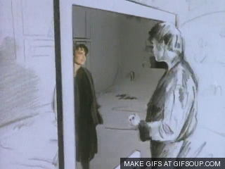

# Go Inside the Data with DataDiVR {#VR-Data-Visualization-Interaction}

#### Keywords {-}
Virtual Reality, VR, Data Visualization, Twitter, DataDiVR

## From 2 to 3 Dimensions.

```{r echo=FALSE,fig.cap='Two-dimensional representation of 3D space has its perils.', fig.align='center',out.width='50%'}
knitr::include_graphics('img/OKGo.gif')
```
Data Visualizations have grown sophisticated in the era of computer-aided design, but for the most part tools to imagine, create and experience three- or four-dimensional visualizations still operate in the awkward translation space of two dimensions.  While these are useful, anyone wrestling with two or more joint distributions of continuous random variables can attest that these relationships are difficult to envision, much less represent.  

```{r echo=FALSE,fig.cap='This is hard to read.', fig.align='center',out.width='50%'}
knitr::include_graphics('https://www.researchgate.net/publication/298429887/figure/fig6/AS:340306768744460@1458146864430/Three-dimensional-scatter-plot-based-on-size-protein-concentration-and-attenuation-of.png')
```
A toolset that places you in the same dimensional space as the visualization would be helpful in deriving insights more quickly and intuitively than in interpreting two-dimensional representations.  In the past two years, virtual reality display technologies and development tools have advanced to the point where this is possible.  While companies like Tableau make it easy to paint pretty, still pictures with data, DataDiVR brings the data to vivid life around you with a set of software tools that quickly turn vectors and matrices into templated VR objects.

## From 3 to 4 Dimensions.

```{r echo=FALSE,fig.cap='Going inside the drawings can provide whole new adventures in <del>dating</del> data.',fig.align='center',out.width='50%'}

```
Several possibilities present themselves as places to start:
* Three-dimensional scatterplots of human-scale dimensions to delineate correlations across three variables, with you standing at the origin.
* Geographic data - stand like a giant over the Bay Area, with county or zipcode-level data hovering over its respective space.
* Three or four-dimensional data models that you can hold and rotate in your hands like a crystal ball
* Social data - rather than a two-dimension scrolling feed, a 360-degree representation of posts and status updates.

It is this last one that DataDiVR will focus on first, as it incorporates temporality:  a Twitter space where tweets fall around you in real-time like rain.  Their relative size is a function of the number of followers the poster has.  Their speed is a measure of their virality.  Their color (via NLP) is a function of their emotional state.  Even their coordinates contain information: Tweets algorithmically determined to be most relevant to your query appear closer, while less relevant ones fall farther away; or you're in a map space of arbitrary dimensions, and geotagged tweets bubble up from where they were sent.  A soundscape reflects the volume of tweets in space at a given time, such that you experience mild tension when in a controversial space.

The data is available via the Twitter API; the primary challenge here is translating it into a virtual space.  Toolsets like WebVR are making it easier for people other than professional game developers to build things, but they are still crude.  Ideally, this would be a collaboration of someone proficient in something like Unity with a data scientist.

## And beyond.

```{r echo=FALSE,fig.cap='Interactive data is sexy.',fig.align='center',out.width='50%'}

```
There's no need to limit the space to simple observation.  Interactivity would allow you to manipulate the data parameters in real time.  Touch a tweet to pause it in midair, expand the picture or play a video clip.  Grab a tweet and make an 'expand' gesture to go inside the tweet and see a replay of its thread.  Putting a user avatar in your pocket follows them, while throwing them into the distance blocks them.  Select a hashtag and fire it overhead to change the search parameters of the space.

While VR hardware is not yet widely distributed, it is well within the grasp of most professionals - there just aren't very many applications for it outside of games and entertainment.  Productivity software like DataDiVR will bring VR into the workspace and enable new insights in both business and research.
